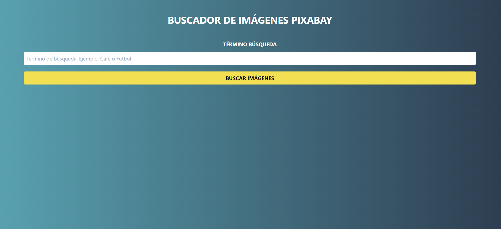
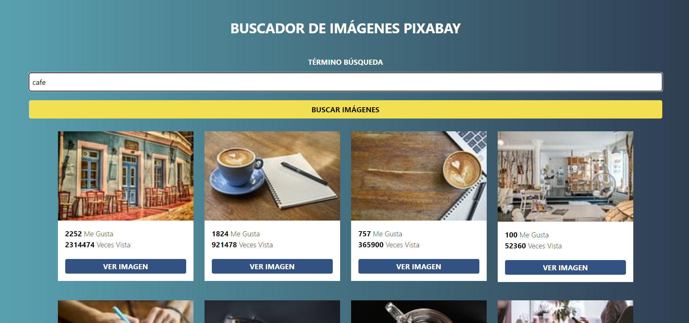
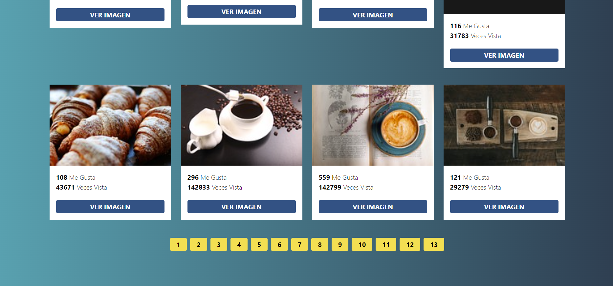

# **`Buscador de imágenes`** 
# *`Este es un buscador con paginación`* 
### **`Nahuel-DevOne`**

# *Información del proyecto:*

El proyecto es un buscador de imágenes con paginación, que utiliza la API de Pixabay.  

## *Version 1.0.0:*

- 

- Utiliza la API de Pixabay

## *Desarrollado con:*

- [Visual Studio Code](https://code.visualstudio.com/)
- [HTML](https://developer.mozilla.org/es/docs/Web/HTML)
- [CSS](https://developer.mozilla.org/es/docs/Web/CSS)
- [Tailwind](https://tailwindcss.com/)
- [JavaScript](https://developer.mozilla.org/es/docs/Web/JavaScript)

## **Screenshots:**

### 1. Inicio:
## 

### 2. Llamado a la API:

## 

### 3. Paginación:

## 

  <!-- Hecho con amor -->
